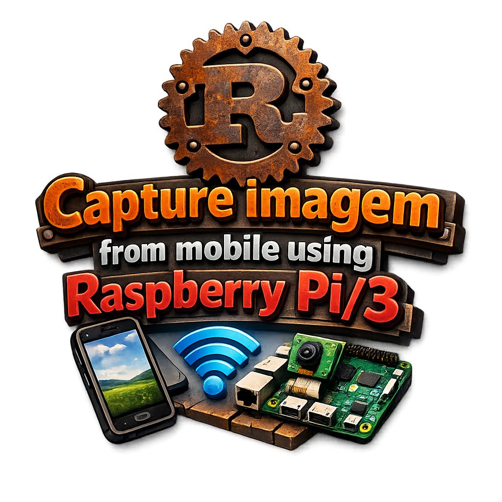

<p align="center">
  
</p>
<h1 align="center">Capture imagem from mobile using Raspberry Pi/3.</h1>

# phone-cam-telegram

PoC em Rust: captura um frame da câmera do celular (frente ou traseira) via **scrcpy** e envia a foto para o **Telegram**.

## Como funciona

1. Chama `scrcpy --video-source=camera --camera-facing=... --time-limit=N --record=...`
2. Extrai 1 frame com `ffmpeg`
3. Faz upload da foto via Bot API do Telegram (`sendPhoto`)

É propositalmente simples (prova de conceito). Não implementa o protocolo scrcpy — apenas orquestra os binários.

## Requisitos

- Celular **Android 12+** (câmera via scrcpy)
- `adb` autorizado (USB ou `adb tcpip 5555` + `adb connect IP:5555`)
- No host/container: `scrcpy`, `ffmpeg`, `adb`

## Uso local

```bash
# Variáveis obrigatórias
export TELEGRAM_BOT_TOKEN="123456:ABC-DEF..."
export TELEGRAM_CHAT_ID="123456789"

# Câmera traseira (padrão)
cargo run -- --facing back

# Câmera frontal com legenda
cargo run -- --facing front --caption "Selfie $(date)"

# Gravação mais longa / resolução menor
cargo run -- --facing back --duration 5 --max-size 960
```

## Docker no Raspberry Pi

```bash
cd ~/ghdeploy/phone-cam-telegram

export TELEGRAM_BOT_TOKEN=...
export TELEGRAM_CHAT_ID=...

# Câmera traseira
docker compose run --rm phone-cam --facing back

# Câmera frontal
docker compose run --rm phone-cam --facing front --caption "teste rasp"
```

> O `docker-compose.yaml` usa `network_mode: host` + `privileged` para o ADB/USB funcionar.  
> Se o celular estiver em ADB over TCP, rode `adb connect IP:5555` no host antes.

## CI/CD

Pipeline no GitHub Actions:

- `test` → `cargo check` / `test`
- `build-and-push` → imagem **linux/arm64** no GHCR (cross-compile via Buildx)
- `deploy` → Tailscale + SSH no Pi, `docker pull` da nova imagem

Secrets necessários:

| Secret               | Descrição                          |
|----------------------|------------------------------------|
| `TS_OAUTH_CLIENT_ID` | OAuth Tailscale                    |
| `TS_OAUTH_SECRET`    | OAuth Tailscale                    |
| `VPS_HOST`           | hostname/IP Tailscale do Pi        |
| `VPS_USER`           | usuário SSH                        |
| `SSH_PRIVATE_KEY`    | chave privada                      |

## Limitações do PoC

- Depende dos binários `scrcpy` + `ffmpeg` (não é 100% pure Rust)
- Grava alguns segundos e pega um frame (latência de alguns segundos)
- Não mantém stream contínuo (só foto sob demanda)
- Android < 12 não tem `--video-source=camera`

## Instalar no Raspi

```sh
sudo apt install scrcpy v4l2loopback-dkms
sudo modprobe v4l2loopback exclusive_caps=1 card_label="Android Camera"
````
